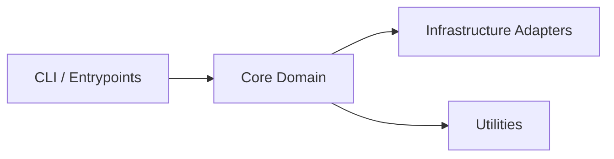

# Architecture

Back to [Tour Home](./index.md)

## Top-level shape

Replace this with the real story of the repo.

Example structure:

- **CLI / entrypoints**: where execution begins
- **Core domain model**: the concepts that matter
- **Infrastructure adapters**: file system, network, persistence, external services
- **Utilities**: lower-level support code that should not become your architecture by accident

## Diagram

## What belongs here

This page is where you explain:

- the important nouns
- the layering rules
- the abstractions worth preserving
- the shortcuts that would rot the design if people got lazy
