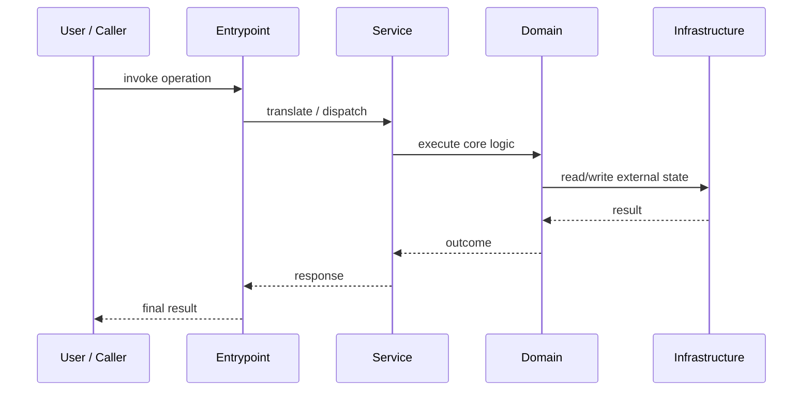

# Event Flow

Back to [Tour Home](./index.md)

For the complete current event inventory, see [Event Reference](./event-reference.md).

## Request / operation flow

Use this page to explain one representative path through the system.

Questions this page should answer:

- what starts the operation?
- what objects coordinate it?
- where is state read?
- where is state written?
- what side effects happen?

## Sequence

## What belongs here

A good page here usually names real classes, real files, and real invariants.
This should become the "trace one thing end to end" page.
