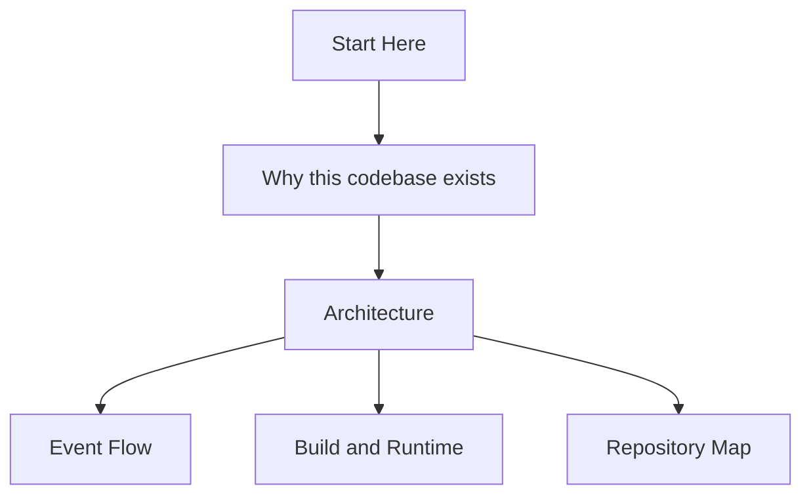

# Fairlanes Guided Tour

Welcome to the tour.

This is not meant to be full reference documentation. It is a map for answering the useful questions first:

- What is Fairlanes for?
- Which abstractions actually matter?
- Where does execution begin?
- Where should I look when something breaks?
- What should I read before spelunking random files?

## Start here

- [Architecture](./architecture.md)
- [Event Flow](./event-flow.md)

## Tour map

## How to use this tour

A good guided tour should do three things:

1. explain the important concepts before the file layout
2. explain the execution path before the helper utilities
3. explain the design constraints before someone gets tempted to "simplify" them into rubble

## Suggested reading order

1. [Architecture](./architecture.md)
2. [Event Flow](./event-flow.md)
3. [Build and Runtime](./build-and-runtime.md)
4. [Repository Map](./repository-map.md)

## What belongs on this page

Over time, this page should become the shortest honest answer to:

> Why should an engineer care about this repo, and where do they begin?
