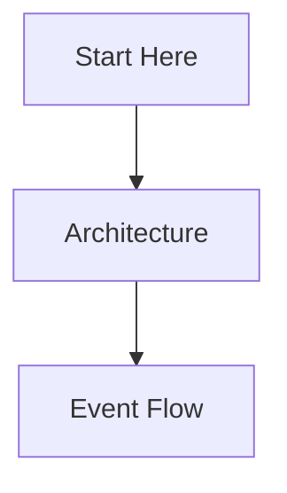

# Fairlanes Guided Tour

This is the front door.

The point of this tour is not to document every file in the repo. It is to explain:

- what Fairlanes is trying to do
- which abstractions matter
- where key decisions live
- what a new engineer should read first

## Suggested path

1. Read the [Architecture](./architecture.md) page
2. Read the [Event Flow](./event-flow.md) page
3. Add deeper pages as the shape of the tour becomes obvious

## Tour map

## Notes

This page should answer:

- Why should I care about this codebase?
- What are the major subsystems?
- Where do I look when something breaks?
