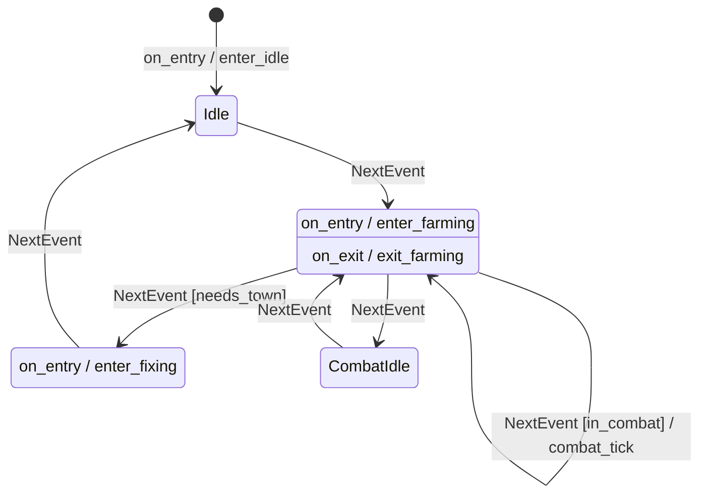

# Party Loop

Fairlanes uses [boost_ext/sml](https://github.com/boost-ext/sml) as its [FSM](../foundations/fsm) library.

One of the main state machines is [PartyLoop](https://github.com/meleneth/fairlanes/blob/89571fb5f3e6396d5e191a557602c2b25c79a31c/src/fl/fsm/party_loop.hpp#L58).

## Current transition table

```cpp
return make_transition_table(
    *state<Idle> + sml::on_entry<_> / enter_idle,
    state<Farming> + sml::on_entry<_> / enter_farming,
    state<Farming> + sml::on_exit<_> / exit_farming,
    state<Fixing> + sml::on_entry<_> / enter_fixing,

    state<Idle> + event<NextEvent> = state<Farming>,
    state<Farming> + event<NextEvent>[needs_town] = state<Fixing>,
    state<Farming> + event<NextEvent>[in_combat] / combat_tick,
    state<Farming> + event<NextEvent> = state<CombatIdle>,
    state<CombatIdle> + event<NextEvent> = state<Farming>,
    state<Fixing> + event<NextEvent> = state<Idle>);
```

## How to read this

SML transition lines generally look like this:

```cpp
state<From> + event<Event>[guard] / action = state<To>
```

Not every part is required.

- `state<From>`: the current state
- `event<Event>`: the event being processed
- `[guard]`: optional condition that must be true
- `/ action`: optional function to run
- `= state<To>`: optional state transition target

So a line can mean:

- enter a state and run setup code
- handle an event and stay in the same state
- handle an event and transition to another state
- handle an event conditionally

## English breakdown

### Entry and exit hooks

```cpp
*state<Idle> + sml::on_entry<_> / enter_idle,
```

- `Idle` is the starting state
- when the machine enters `Idle`, run `enter_idle`

```cpp
state<Farming> + sml::on_entry<_> / enter_farming,
```

- when the machine enters `Farming`, run `enter_farming`

```cpp
state<Farming> + sml::on_exit<_> / exit_farming,
```

- when the machine leaves `Farming`, run `exit_farming`

```cpp
state<Fixing> + sml::on_entry<_> / enter_fixing,
```

- when the machine enters `Fixing`, run `enter_fixing`


## High-level flow


# Party Loop



In English, the loop is roughly:

- start in `Idle`
- next tick moves to `Farming`
- while farming:
  - if town work is needed, go to `Fixing`
  - if combat is happening, process a combat tick
  - otherwise move into `CombatIdle`
- `CombatIdle` moves back to `Farming`
- `Fixing` moves back to `Idle`

## What to notice

- `NextEvent` appears to act like the machine's general “advance the loop” event
- not every event handler causes a state transition
- guards matter a lot, especially in `Farming`
- the ordering of transitions is important for understanding intent
- `combat_tick` is a behavior triggered inside the FSM, not a separate polling loop

## Why this matters

This state machine is one of the places where Fairlanes makes game flow explicit.

Instead of scattering “if farming, maybe combat, maybe town” logic across the codebase, the allowed flow is written down as a transition table.

That gives us:
- readable control flow
- constrained state progression
- a single place to reason about the party loop

## Fairlanes take

We use FSMs when the flow itself is important enough to deserve first-class structure.

`PartyLoop` is not just a pile of conditionals. It is a declared model of how the party advances.

`Farming` is the most interesting state here because it can either redirect the loop, process combat in place, or fall through to the next state depending on the current conditions.

